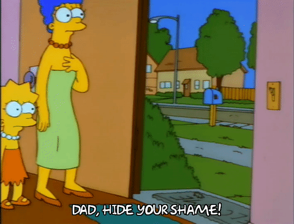
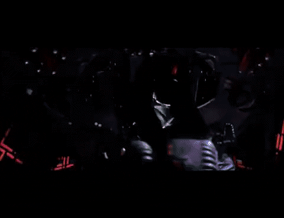

I'd like to improve on my follow-through: finishing projects that I've started, especially before moving to another. I've begun and failed to complete:

* An x64 operating system.
* A blog on wordpress.
* Hotel[.]NET, a C# Actor/plugin framework.
* Marin, a Unity-based Link's Awakening clone.
* system, another x64 operating system.
* An Age of Empires clone based in Unity.
* A blog on Github Pages.
* Toyos, a third x64 operating system.

Those are a lot of unfinished projects! To be fair, I've learned a lot from each one, and none of these them can really be "finished"; there's always more bugs to fix, features to implement, or posts to make. They also follow cyclical themes: operating systems, games, and blogs, so while I abandon projects, I don't abandon concepts or topics - each attempt teaches me a little more. This is not a pattern I want to continue, though!


# Projects, Projected

This is my typical pattern of project execution:

```
E
X   _________           _____
C            \         /     \
I             \       /       \      ____
T       1      \     /    2    \    /    \
E               \   /           \  /   3  \               4             ___
M                \_/_____________\/        \___________________________/ 5 \
E                       
N
T                                          Time
```
               
1. PROJECT A IS GOING TO BE AMAZING! I have so many GREAT ideas! Let's put my previous attempt at A in the garbage WHERE IT BELONGS!
1. I read an article about Subject B yesterday...that is SUPER COOL, and I have some pretty good ideas on how I could implement it. On a COMPLETELY UNRELATED NOTE, I forgot how hard building an A is, and it's taken a ton of work to get anywhere. I'm tired of A. Why not work on something simpler and more exciting?
3. No. I need to persevere and keep working on Project A. Maybe work on A and B and the same time? An hour a day on one or the other, I can do that.
4. Months pass. Work gets busy, life goes a different direction. Supplies run low. Perhaps a Project C or D come along!
5. I should probably archive Projects A and B since I've forgotten what I was doing...and make the Github projects private to HIDE MY SHAME!



So! I need to change some things in order to improve my follow-through.

## Embrace the suck.
Hard work is rewarding when I'm excited about the work! It's tiring and boring when I'm not excited. I have to accept that the work will be difficult for awhile, and learn to like the grind, as long as it's progressing in roughly the right direction.

## Work small, note big.
A text-mode logger is fine for now - I don't need an extensible logging system with serial and VGA log sinks, filtering, and log levels. That's a great idea, but it's BIG! Take some notes, write a draft blog post, draw some diagrams! Quickly. Implement it later when the need arises.

## Stay on target.
Some things are going to drag on, or require additional legwork to get finished. When I have to move over to another part of the code, another blog post, etc, I need to remember the goal rather than getting distracted. That's how Gold Leader died.



## Work, Right, Simple.
There's a mantra from Agile/UNIX software development: ["make it work, make it right, make it fast"](http://wiki.c2.com/?MakeItWorkMakeItRightMakeItFast) (I prefer "simple" to "fast"). I'm terrible at this! My first version of - well, anything really - is usually a dumpster fire that barely works. Rather than iterating on it until it's more stable, clearer, or useful, I get bogged down re-writing it from scratch over and over to fix perceived style/maintainability problems. A month later, I have something that looks pretty but isn't any more stable/functional/useful than what I banged out in 5 minutes! 

# Conclusion

I'm going to re-open the "toyos" OS project and re-use what I can, then continue from there. I may post notes/plans and interesting things I've learned here, but I need to focus on the OS for now. I'll detail the basics in another post, but I'm going to get to 64-bit user mode as fast as possible.

This will be hard! I will not like it! I will regret this. It's going to be **GREAT**!

